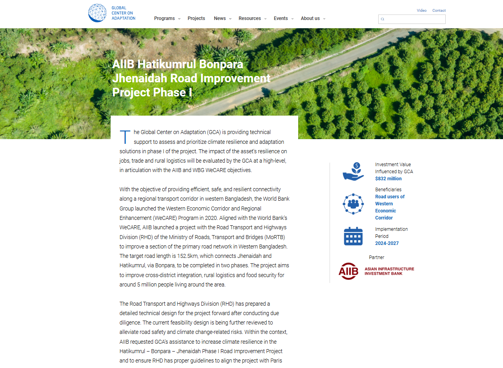
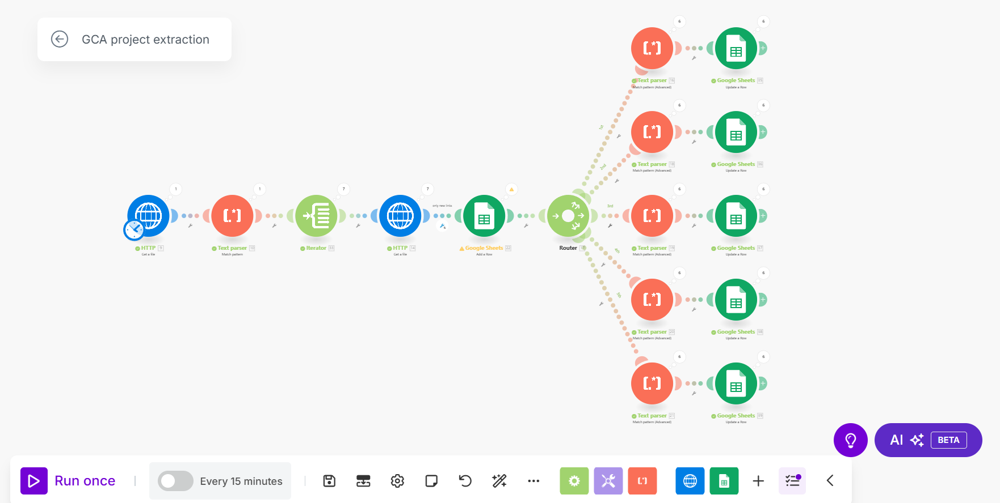
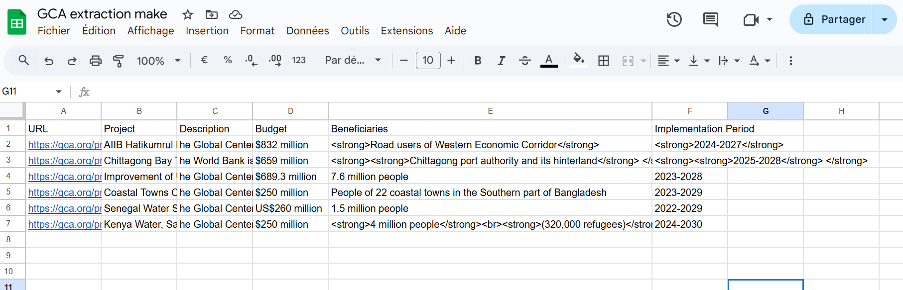

# GCA Project Extraction – Scenario Report
## 1. Executive Summary
The “GCA project extraction” scenario is designed to automatically retrieve and parse project information from gca.org/projects/. The workflow extracts project URLs and then scrapes detailed project data—such as headings, descriptions, investment details, beneficiaries, and implementation periods—from individual project pages. Finally, the extracted data is inserted or updated into a Google Sheets spreadsheet for further analysis and reporting.

## 2. Introduction
In today’s data-driven environment, automating data extraction and processing is critical for maintaining up-to-date insights. This scenario was developed to streamline the extraction of project details from the GCA website and to store this information in a structured format within Google Sheets. The automated workflow improves accuracy and reduces manual work, ensuring that the data remains current and actionable.

The objective is to simultaneously extract comprehensive information from every GCA project page.

## 3. Scenario Overview
The scenario, titled "GCA project extraction", comprises several interconnected modules that perform the following tasks:

- Data Retrieval: An HTTP module fetches the main projects page.
- Link Extraction: A regular expression parser scans the page for project URLs.
- Data Feeding: A feeder module prepares the extracted URLs for further processing.
- Project Detail Retrieval: For each project URL, another HTTP module fetches the individual project page.
- Data Parsing: Multiple regular expression modules extract specific details from the HTML content.
- Google Sheets Integration: The extracted data is written to a Google Sheets spreadsheet, both as new rows and via updates.

## 4. Detailed Workflow Description
### 4.1 Initial Data Retrieval
Module 9 – HTTP:ActionGetFile:
This module initiates the process by sending an HTTP GET request to https://gca.org/projects/. It is configured not to handle errors internally, allowing the scenario to proceed only if a valid 2xx or 3xx response is received.

### 4.2 Extracting Project URLs
Module 10 – Regexp:Parser:
A regular expression (href="(https://gca.org/projects/[^"]+)") is used to scan the HTML content for all project URLs. The parser is set to operate globally to capture all matching instances.

Module 33 – BasicFeeder:
The feeder takes the array of captured URLs from Module 10 and prepares them for subsequent HTTP requests. This step ensures that each project URL is individually processed.

### 4.3 Fetching Project Details
Module 14 – HTTP:ActionGetFile (Project Page):
For each URL provided by the feeder, this module makes an HTTP GET request to fetch the corresponding project page. This is where the detailed project information is sourced.

### 4.4 Google Sheets – Adding Initial Data
Module 22 – Google Sheets:addRow:
New project URLs are added as new rows to a designated Google Sheets document. This module is configured with a specific spreadsheet ID and sheet name (e.g., "Feuille 1") and includes headers that map to various data points (e.g., URL, Project, Description, Budget).

### 4.5 Data Parsing and Updating in Google Sheets
A router (Module 17 – BasicRouter) directs the workflow into several parallel paths, each dedicated to extracting and updating a specific piece of project information:

Route 1 – Extracting Project Heading:

Module 16 – Regexp:AdvancedParser:
Uses a pattern targeting the page header to capture the project title.
Module 35 – Google Sheets:updateRow:
Updates the corresponding row in Google Sheets with the project title.
Route 2 – Extracting Project Description:

Module 18 – Regexp:AdvancedParser:
Extracts the project description using a pattern that matches paragraph elements containing descriptive text.
Module 36 – Google Sheets:updateRow:
Updates the description column in the same row.
Route 3 – Extracting Investment Value:

Module 19 – Regexp:AdvancedParser:
Targets a specific heading and paragraph pair that describes the “Investment Value Influenced by GCA.”
Module 37 – Google Sheets:updateRow:
Updates the relevant column with the investment value information.
Route 4 – Extracting Beneficiaries:

Module 20 – Regexp:AdvancedParser:
Uses a pattern to extract the beneficiaries’ information from the HTML content.
Module 38 – Google Sheets:updateRow:
Updates the beneficiaries column in the spreadsheet.
Route 5 – Extracting Implementation Period:

Module 21 – Regexp:AdvancedParser:
Extracts the implementation period data using a targeted pattern.
Module 39 – Google Sheets:updateRow:
Finalizes the row update with the extracted implementation period data.
Each Google Sheets module is configured with settings such as “valueInputOption” and “insertDataOption” to ensure that the data is correctly formatted and inserted as new rows or updated in existing ones.

## 5. Error Handling and Robustness
Error Handling:
Throughout the scenario, parameters like handleErrors are set to false to allow the scenario to fail fast in case of issues, ensuring that only valid data is processed.
Regular Expression Settings:
Global matching, case sensitivity, and other parser configurations are finely tuned for the targeted HTML structures. This setup minimizes errors in data extraction and ensures that the process is reproducible.

## 6. Google Sheets Integration
The scenario leverages Google Sheets modules to:

Add New Rows: When new projects are detected.
Update Existing Rows: As additional information is parsed from individual project pages.
This integration not only provides a centralized view of all extracted data but also facilitates further analysis and reporting by stakeholders.

## 7. Results 

The output is a Google Sheets document where each row represents a project link along with its complete set of extracted details. Although the current format relies on HTML and regex code and could benefit from refinement, it successfully captures all the necessary information.

## 8. Conclusion and Recommendations
The “GCA project extraction” scenario effectively automates the process of retrieving, parsing, and storing project data from a web source into a Google Sheets document. The modular design—with clear separation between data fetching, parsing, and storage—allows for easy updates and maintenance. Future improvements might include:

Enhancing error logging for better troubleshooting.
Expanding the parsing logic to capture additional project details.
Integrating more robust error-handling mechanisms to manage edge cases in HTML variations.
Overall, this scenario demonstrates a powerful approach to automating data workflows that are essential for timely and accurate reporting.